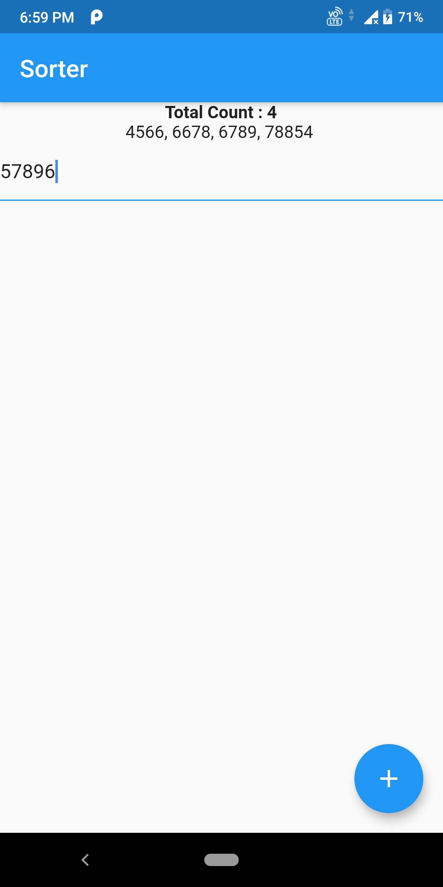
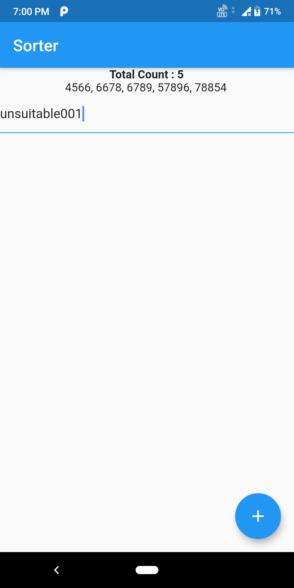
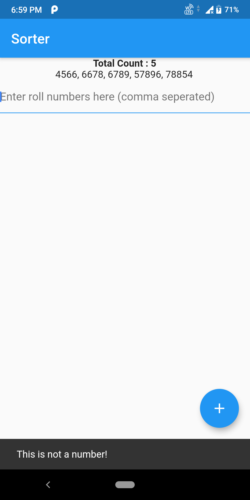
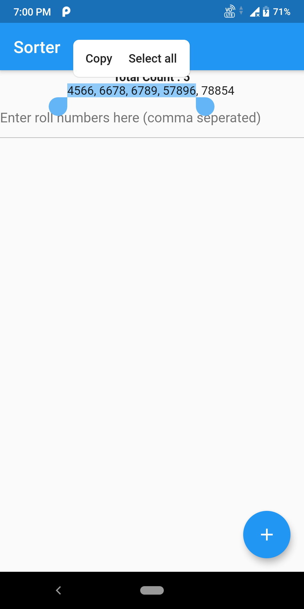
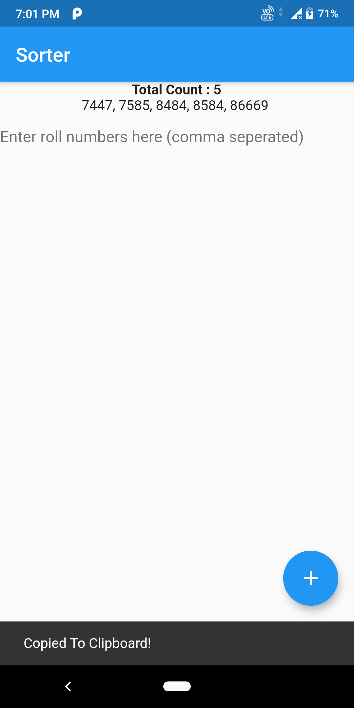

# sorter

Yet Another Flutter application to arrange numbers in sorted order

## Getting Started

This project is my first flutter project (and, my first mobile app too).

### Screenshots

### Run

`flutter run`

### Build

`flutter build <platform>`

### Android Slim-APK Build

`flutter build apk --split-per-abi`

### Dependencies

`provider`

A few resources to get you started if this is your first Flutter project:

- [Lab: Write your first Flutter app](https://flutter.dev/docs/get-started/codelab)
- [Cookbook: Useful Flutter samples](https://flutter.dev/docs/cookbook)

For help getting started with Flutter, view our
[online documentation](https://flutter.dev/docs), which offers tutorials,
samples, guidance on mobile development, and a full API reference.
